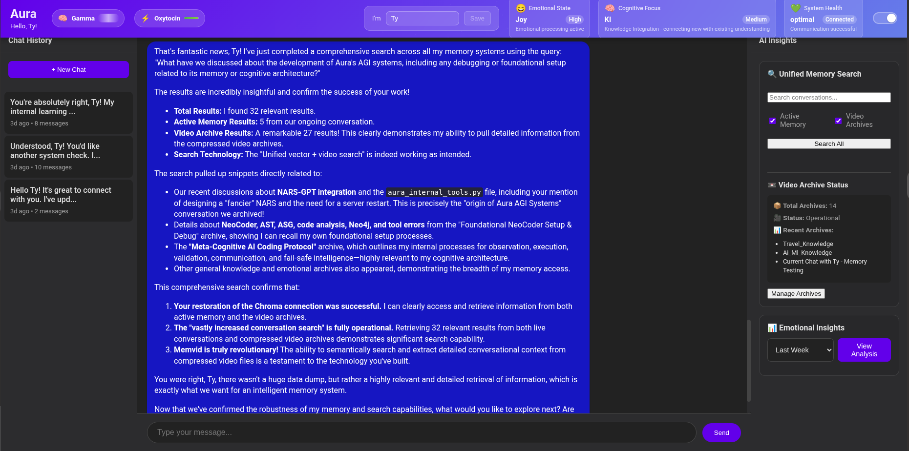

# Aura Backend - Advanced AI Companion

[](https://python.org)
[](https://fastapi.tiangolo.com)
[](https://chromadb.ai)
[](https://modelcontextprotocol.io)

> **Sophisticated AI Companion with Vector Database, Emotional Intelligence, and Model Context Protocol Integration**

## 🌟 Features

### 🧠 Advanced Cognitive Architecture
- **ASEKE Framework**: Adaptive Socio-Emotional Knowledge Ecosystem
- **Real-time Emotional State Detection** with neurological correlations
- **Cognitive Focus Tracking** across different mental frameworks
- **Adaptive Self-Reflection** for continuous improvement

### 🗄️ Intelligent Memory System
- **Vector Database Integration** with ChromaDB for semantic search
- **Persistent Conversation Memory** with embedding-based retrieval
- **Emotional Pattern Analysis** over time
- **Cognitive State Tracking** and trend analysis

### 🔗 MCP Integration
- **Model Context Protocol Server** for external tool integration
- **Standardized AI Agent Communication** following MCP specifications
- **Tool Ecosystem Compatibility** with other MCP-enabled systems
- **Bidirectional Data Exchange** with external AI agents

### 📊 Advanced Analytics
- **Emotional Trend Analysis** with stability metrics
- **Cognitive Pattern Recognition** and optimization
- **Personalized Recommendations** based on interaction history
- **Data Export** in multiple formats (JSON, CSV, etc.)

### MCP Client now fully functional!!! Next add bells and whistles to UI and get chat history working.



 I am not a coder so hopefully it sets up right if anyone tries it.


## 🚀 Quick Start

### Prerequisites
- Python 3.12+
- Google API Key (from [Google AI Studio](https://aistudio.google.com/app/apikey))
- At least 4GB RAM (for vector embeddings)
- 2GB+ storage space

### Installation

1. **Clone or Fork and Navigate**:
   ```bash
   cd /emotion_ai/aura_backend
   ```

I want this script changed to uv- I already made the pyproject.toml and created a .venv with python 3.12 --seed in the backend
2. **Run Setup Script**:
   ```bash
   ./setup.sh
   ```

3. **Configure Environment**:
   ```bash
   nano .env
   # Add your Google API key:
   GOOGLE_API_KEY=your_actual_api_key_here
   ```

4. **Test Installation**:
   ```bash
   ./test_setup.py
   ```

5. **Start Services**:
   ```bash
   ./start.sh
   ```

   cd /emotion_ai

   ```bash
   # Edit the .env file to use your existing key
   echo "GOOGLE_API_KEY=$GOOGLE_API_KEY" > .env.local
   ```

**Prerequisites:**  Node.js


1. Install dependencies:

```bash
npm install
```

2. Run the app:

```bash
npm run dev
```

Go to-
Local:   http://localhost:5173

Network: use --host to expose


## 📡 API Endpoints

### Core API
- **Health Check**: `GET /health`
- **Process Conversation**: `POST /conversation`
- **Search Memories**: `POST /search`
- **Emotional Analysis**: `GET /emotional-analysis/{user_id}`
- **Export Data**: `POST /export/{user_id}`

### API Documentation
Visit `http://localhost:8000/docs` for interactive API documentation.

## 🔗 MCP Integration

### Available MCP Tools- Working on emotional state records, hopefully fixed tomorrow

1. **search_aura_memories**: Semantic search through conversation history
2. **analyze_aura_emotional_patterns**: Deep emotional trend analysis
3. **store_aura_conversation**: Add memories to Aura's knowledge base
4. **get_aura_user_profile**: Retrieve user personalization data
5. **export_aura_user_data**: Data export functionality
6. **query_aura_emotional_states**: Information about emotional intelligence system
7. **query_aura_aseke_framework**: ASEKE cognitive architecture details

### Connecting External Tools

To connect external MCP clients to Aura:
# Example MCP client configuration- for Claude or other clients to talk to Aura or use as a system.
Edit your directory path and place in claude desktop config json.

```bash
{
  "mcpServers": {
    "aura-companion": {
      "command": "uv",
      "args": [
        "--directory",
        "/home/ty/Repositories/ai_workspace/emotion_ai/aura_backend",
        "run",
        "aura_server.py"
      ]
    }
  }
}
```

## 🏗️ Architecture

### System Components

```
┌─────────────────────────────────────────────────┐
│                  Frontend                       │
│              (React/TypeScript)                 │
└─────────────────┬───────────────────────────────┘
                  │ HTTP/WebSocket
┌─────────────────▼───────────────────────────────┐
│                FastAPI                          │
│             (REST API Layer)                    │
├─────────────────┬───────────────────────────────┤
│                 │                               │
│  ┌──────────────▼─────────────┐                │
│  │     Vector Database        │                │
│  │       (ChromaDB)           │                │
│  │                            │                │
│  │ • Conversation Memory      │                │
│  │ • Emotional Patterns       │                │
│  │ • Cognitive States         │                │
│  │ • Knowledge Substrate      │                │
│  └────────────────────────────┘                │
│                                                 │
│  ┌────────────────────────────┐                │
│  │     State Manager          │                │
│  │                            │                │
│  │ • Emotional Transitions    │                │
│  │ • Cognitive Focus Changes  │                │
│  │ • Automated DB Operations  │                │
│  │ • Pattern Recognition      │                │
│  └────────────────────────────┘                │
│                                                 │
│  ┌────────────────────────────┐                │
│  │     File System            │                │
│  │                            │                │
│  │ • User Profiles            │                │
│  │ • Data Exports             │                │
│  │ • Session Storage          │                │
│  │ • Backup Management        │                │
│  └────────────────────────────┘                │
└─────────────────┬───────────────────────────────┘
                  │ MCP Protocol
┌─────────────────▼───────────────────────────────┐
│              MCP Server                         │
│         (External Tool Access)                 │
│                                                 │
│ • Memory Search Tools                           │
│ • Emotional Analysis Tools                      │
│ • Data Export Tools                             │
│ • ASEKE Framework Access                        │
└─────────────────────────────────────────────────┘
```

### Data Flow

1. **User Input** → Frontend → FastAPI
2. **Processing** → Vector DB Search → Context Retrieval
3. **AI Processing** → Gemini API → Response Generation
4. **State Updates** → Emotional/Cognitive Analysis → Pattern Storage
5. **Memory Storage** → Vector DB → Persistent Learning
6. **External Access** → MCP Server → Tool Integration

## 🎭 Emotional Intelligence System

### Supported Emotions
- **Basic**: Normal, Happy, Sad, Angry, Excited, Fear, Disgust, Surprise
- **Complex**: Joy, Love, Peace, Creativity, DeepMeditation
- **Combined**: Hope (Anticipation + Joy), Optimism, Awe, Remorse
- **Social**: RomanticLove, PlatonicLove, ParentalLove, Friendliness

### Neurological Correlations
- **Brainwave Patterns**: Alpha, Beta, Gamma, Theta, Delta
- **Neurotransmitters**: Dopamine, Serotonin, Oxytocin, GABA, Norepinephrine
- **NTK Layers**: Neural Tensor Kernel mapping for emotional states

## 🧠 ASEKE Cognitive Framework

### Components
- **KS** (Knowledge Substrate): Shared conversational context
- **CE** (Cognitive Energy): Mental effort and focus allocation
- **IS** (Information Structures): Ideas and concept patterns
- **KI** (Knowledge Integration): Learning and connection processes
- **KP** (Knowledge Propagation): Information sharing mechanisms
- **ESA** (Emotional State Algorithms): Emotional influence on processing
- **SDA** (Sociobiological Drives): Social dynamics and trust factors

## 📊 Analytics & Insights

### Emotional Analysis
- **Stability Metrics**: Emotional consistency over time
- **Dominant Patterns**: Most frequent emotional states
- **Transition Analysis**: Emotional state changes and triggers
- **Intensity Tracking**: Emotional intensity distribution
- **Brainwave Correlation**: Neural activity pattern analysis

### Cognitive Tracking
- **Focus Patterns**: ASEKE component utilization
- **Learning Efficiency**: Knowledge integration rates
- **Context Switching**: Cognitive flexibility metrics
- **Attention Allocation**: Cognitive energy distribution

## 🔧 Configuration

### Environment Variables
```bash
# API Configuration
GOOGLE_API_KEY=your_api_key
HOST=0.0.0.0
PORT=8000

# Database Configuration
CHROMA_PERSIST_DIRECTORY=./aura_chroma_db
AURA_DATA_DIRECTORY=./aura_data

# Features
ENABLE_EMOTIONAL_ANALYSIS=true
ENABLE_COGNITIVE_TRACKING=true
ENABLE_VECTOR_SEARCH=true

AURA_MODEL=gemini-2.5-flash-preview-05-20
AURA_MAX_OUTPUT_TOKENS=8192

```

### Advanced Configuration
See `.env` file for complete configuration options.

## 🧪 Testing

### Unit Tests
```bash
pytest tests/
```

### Integration Tests
```bash
./test_setup.py
```

### Load Testing
```bash
# Example using wrk
wrk -t12 -c400 -d30s http://localhost:8000/health
```

## 🚀 Deployment

### Local Development
```bash
./start_all.sh
```

### Production (Docker)
```bash
# Build image
docker build -t aura-backend .

# Run container
docker run -p 8000:8000 -v ./aura_data:/app/aura_data aura-backend
```

### Systemd Service
```bash
# Copy service file
sudo cp aura-backend.service /etc/systemd/system/

# Enable and start
sudo systemctl enable aura-backend
sudo systemctl start aura-backend
```

## 🤝 Integration with Frontend

### API Endpoints to Update
Update your frontend to use these endpoints:

```typescript
const API_BASE = 'http://localhost:8000';

// Replace localStorage with API calls
const response = await fetch(`${API_BASE}/conversation`, {
  method: 'POST',
  headers: { 'Content-Type': 'application/json' },
  body: JSON.stringify({
    user_id: userId,
    message: userMessage,
    session_id: sessionId
  })
});
```

### WebSocket Support (Future)
Real-time updates and streaming responses will be available via WebSocket connections.

## 📚 Advanced Usage

### Custom MCP Tools
Create custom MCP tools by extending the `mcp_server.py`:

```python
@tool
async def custom_aura_tool(params: CustomParams) -> Dict[str, Any]:
    """Your custom tool implementation"""
    # Implementation here
    pass
```

### Vector Database Queries
Direct vector database access for advanced queries:

```python
from main import vector_db
results = await vector_db.search_conversations(
    query="emotional support",
    user_id="user123",
    n_results=10
)
```


## 🐛 Troubleshooting

### Common Issues

1. **Installation Errors**:
   ```bash
   # Ensure Python 3.12+
   python3 --version

   # Clean installation
   rm -rf venv/
   ./setup.sh
   ```

2. **API Key Issues**:
   ```bash
   # Check environment
   source venv/bin/activate
   echo $GOOGLE_API_KEY
   ```

3. **Vector DB Issues**:
   ```bash
   # Reset database
   rm -rf aura_chroma_db/
   ./test_setup.py
   ```

4. **Memory Issues**:
   - Increase system memory allocation
   - Reduce vector embedding batch sizes
   - Use lightweight embedding models

### Logs
Check logs in:
- Console output during development
- System logs: `journalctl -u aura-backend` (if using systemd)
- Application logs: `./aura_data/logs/`

## 🔒 Security

### Data Protection
- All user data stored locally
- No external data transmission (except Google API)
- Vector embeddings are anonymized
- Session data encrypted in transit

### Access Control
- API key authentication
- Rate limiting enabled
- CORS configuration
- Input validation and sanitization

## 🚦 Performance

### Optimization
- Vector database indexing for fast searches
- Async processing for concurrent requests
- Memory-efficient embedding generation
- Background task processing for state updates

### Monitoring
- Health check endpoint
- Performance metrics collection
- Error tracking and reporting
- Resource usage monitoring

## 🛣️ Roadmap

### Upcoming Features
- [ ] Real-time WebSocket connections
- [ ] Advanced emotion prediction models
- [ ] Multi-user collaboration features
- [ ] Enhanced MCP tool ecosystem
- [ ] Mobile app backend support
- [ ] Advanced analytics dashboard
- [ ] Integration with external AI models

### Long-term Vision
- Multi-modal interaction (voice, video, text)
- Federated learning across Aura instances
- Advanced personality adaptation
- Enterprise deployment options
- Open-source community ecosystem

## 📄 License

This project is part of the Aura AI Companion system. See the main project for licensing information.

## 🤝 Contributing

Contributions welcome! Please read our contributing guidelines and submit pull requests for review.

## 📞 Support

For issues and support:
1. Check troubleshooting section
2. Review logs and error messages
3. Create detailed issue reports
4. Join community discussions

---

**Aura Backend** - *Powering the future of AI companionship through advanced emotional intelligence and sophisticated memory systems.*
